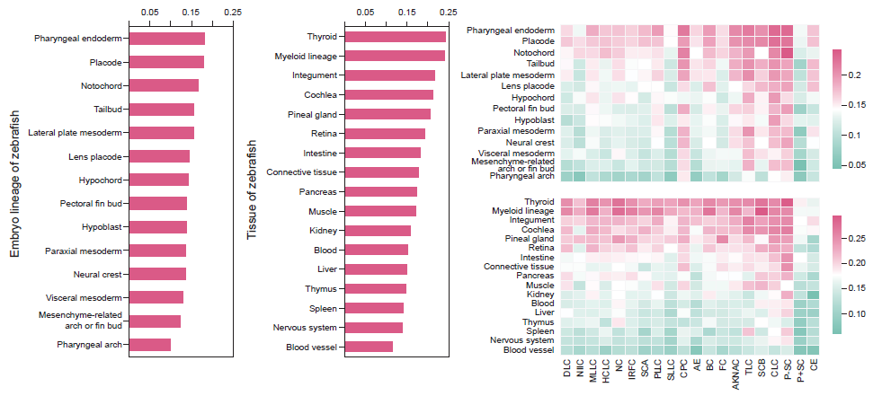
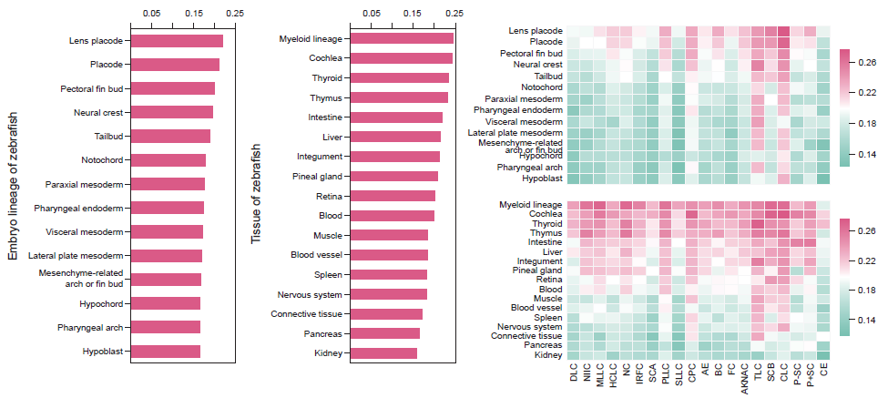

### step 1. reciprocal blast using S. clava and zebrafish protein sequences

- blast zebrafish protein against styela
```shell
makeblastdb -in styela.pep -dbtype nucl
tblastx -query zebrafish.pep -db styela.pep -outfmt 6 -out ./reciprocal_blast/zf2sc.txt -max_hsps 1 -evalue 1e-6
```
- blast styela protein against zebrafish
```shell
makeblastdb -in zebrafish.pep -dbtype nucl
tblastx -query styela.pep -db zebrafish.pep -outfmt 6 -out ./reciprocal_blast/sc2zf.txt -max_hsps 1 -evalue 1e-6
```

### step 2. find confident hits from blast output

- detect top one best hit as one-to-one homologous
```shell
python get_best_from_blast.py -best -out blast.single.txt
```
- kneedle-based detection of best hits as one-to-many homologous
```shell
python get_best_from_blast.py -out blast.multi.txt
```

### step 3. extract transcription factor associated matches
download zebrafish transcription factors from animalTFDB
```
wget http://bioinfo.life.hust.edu.cn/AnimalTFDB4/static/download/TF_list_final/Danio_rerio_TF -O zebrafish.TF.txt
```
extract TF from one-to-one and one-to-many seperately
```shell
python3 extract_TF_from_best.py -input blast.single.txt -out blast.single.TF.txt

python3 extract_TF_from_best.py -input blast.multi.txt -out blast.multi.TF.txt
```

### step 4. spearman correlation estimation

- for one-to-one version correlation
```shell
python3 correlation_estimation.py \
    -input blast.single.TF.txt \
    -type single \
    -figname corr.single
```

- for one-to-many version correlation
```shell
python3 correlation_estimation.py \
    -input blast.multi.TF.txt \
    -type multi \
    -strategy mean \
    -figname corr.multi 
```

