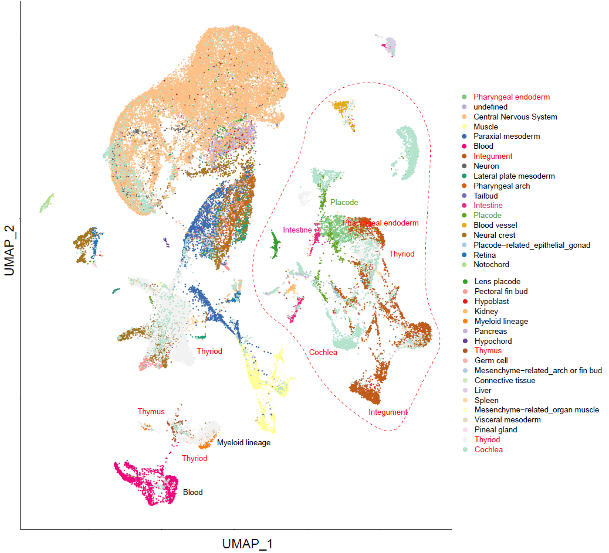
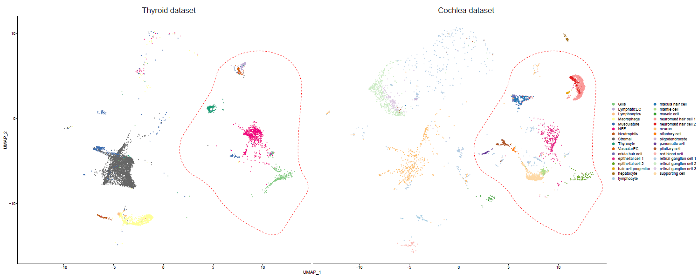

# How to run

### Pre-process and integrate zebrafish datasets

> The zebrafish datasets were collectted from [Farnsworth et al.](https://www.sciencedirect.com/science/article/pii/S0012160619304919), [Qian et al.](https://link.springer.com/article/10.1007/s00018-022-04410-2) and [Gillotay et al.](https://www.embopress.org/doi/full/10.15252/embr.202050612).

we first integrated zebrafish datasets using seurat
```shell
$ Rscript zebrafish.integrate.R
```


the result shows that *Central Nervous System* cells occupied large part of the data, so we further filtered the developmental dataset to keep cells with clear sampling time recorded.

```shell
$ Rscript zebrafish.subset.R
``` 

this will generate the final zebrafish dataset which shall be used in our comparison analysis, including files `zebrafish.final.rds` and `zebrafish.final.loom`

### SAMap comparison for thyroid like cell and hair cell-like cell

**step 1:** *pseudo-metacell* aggregation


**step 2:** SAMap perform


**step 3:** sankey plot


### Additional intepretion

As the result of cross-species comparison largely depend on quality of the dataset we can access, it is necessary to perform with reasonalble filteration process.

In our case, both the zebrafish thyroid data and cochlea data somewhat co-embedded with nervous and immune cells from the zebrafish developmental dataset, as shown in below figure, which might caused by residual sampling.



So we use diverse filtering criteria for different purpose to avoid this problem. And the final used cell groups in each task was labeled in their code or description seperately.
