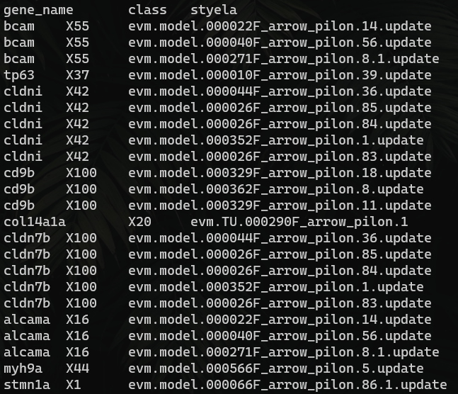
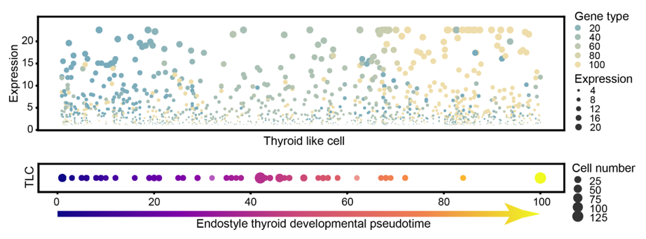
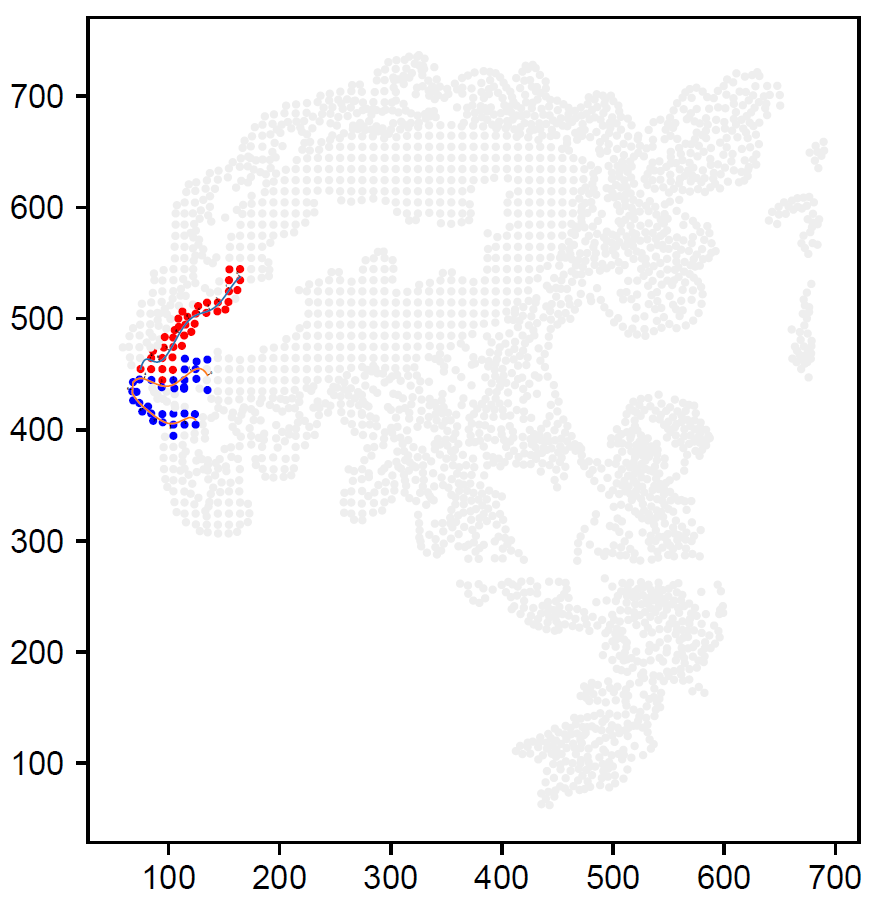
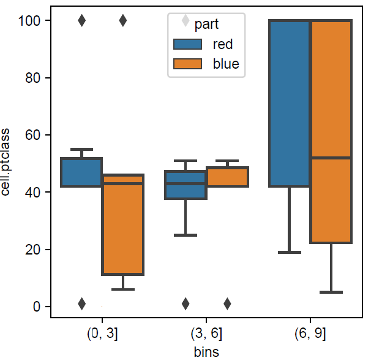

# How to run

## *Developmental trajectory inference for zebrafish thyroid

```shell
$ Rscript monocle2.R
```
The generated trajectory related genes will be used to order endostyle TLC cells

## *Trajectory projection onto endostyle TLC

**step 1:** classify trajectory related genes into different developmental stages

```shell
$ python3 classify_trajectory_genes.py
```


In this step, the zebrafish trajectory related genes were classified based on their highest expression pseudotime and further mapped to *S. clava* genes based on the orthologous relationships. These genes were then used in following steps.

**step 2:** calculate expression matrix of endostyle TLC cells
```shell
$ python3 extract_TLC_exp.py
```

**step 3:** ordering endostyle TLC cells based on the expression of trajectory related genes
```shell
$ python3 trajectory_mapping.py
```


## *Spatial preference calculation

```shell
$ python3 region_divide_pt.py
```


With the one line command executed, the following steps were processed:

- divide the TLC cells into two half side (red and blue in the figure)


- perform curve fitting to represent the TLC cells location (the curve lines in the figure), and partition the curve into three sub-regions (ticks on the curve line)

- project cells into different partitions based on the nearest distance of cell to curve line

- compare the pseudotime distribution among three partitions along the ventral-to-dorsal axis (the result was shown in the below boxplot)


